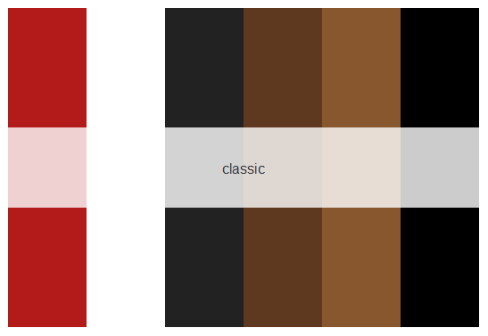
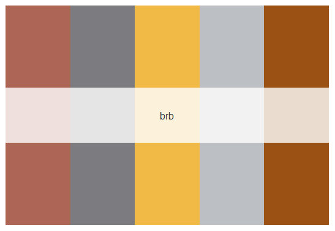
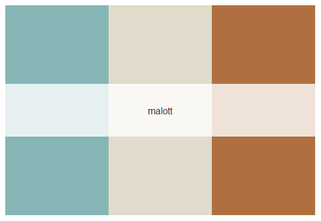
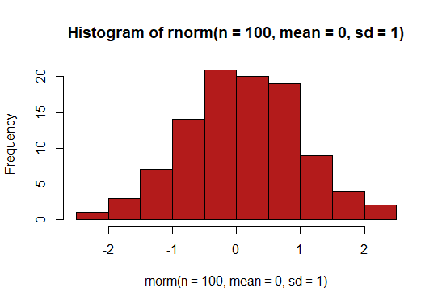

# cornellcolors
Contains code for R package with R color palettes inspired by Cornell University.
Code adopted from the lovely `inauguration` R package by Cianna Bedford-Petersen, available [here](https://github.com/ciannabp/inauguration). 


# R package installation
Install the  `cornellcolors` R package using the following code:
``` r
#install.packages("devtools")
devtools::install_github("kimberlywebb/cornellcolors", ref="main")
library(cornellcolors)
```

# Using the cornellcolors package
Use the `names` function to view the available color palettes.
```r
names(cornell_palettes)
#> [1] "classic"   "secondary" "accents"   "malott"    "brb" 
```

Call the palette using the `render_cornell_colors` function
```r
render_cornell_colors("classic")
```


Enjoy Big Red Barn vibes, even if it isn't T.G.I.F
```r
render_cornell_colors("brb")
```


View a subset of the color scheme inspired by Malott Hall
```r
render_cornell_colors("malott", 3)
```


Use colors from `cornell_palettes` in your graphs
```r
set.seed(1)
hist(rnorm(n = 100, mean = 0, sd = 1), col = cornell_palettes[["classic"]][1])
```

